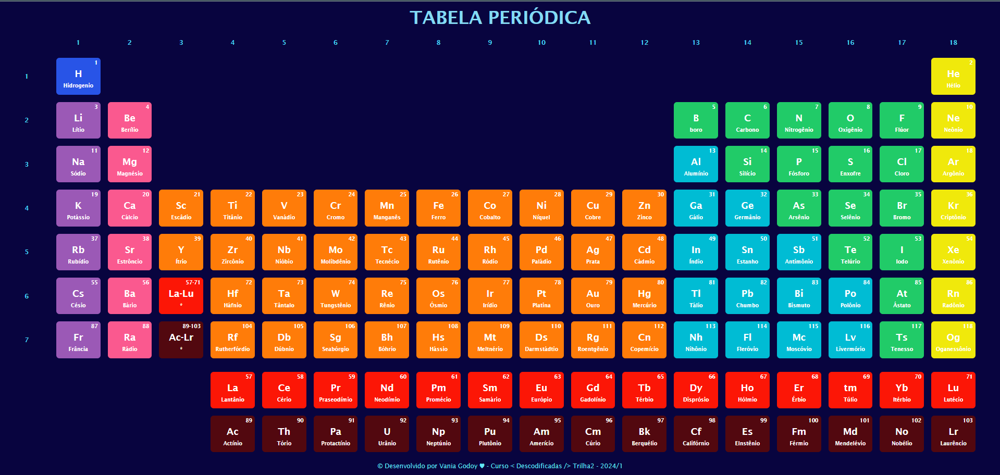

# Tabela Periódica

Este projeto consiste em uma representação visual da Tabela Periódica dos elementos químicos, implementada utilizando HTML, CSS.

## Descrição

A Tabela Periódica é uma ferramenta essencial na química, fornecendo informações sobre os elementos conhecidos e suas propriedades. Este projeto apresenta uma versão interativa e visualmente atraente da Tabela Periódica, facilitando a compreensão e o aprendizado dos elementos químicos.

## Funcionalidades

- Visualização dos elementos químicos organizados em grupos e períodos.
- Destaque das propriedades dos elementos ao passar o mouse sobre eles.
- Layout responsivo para uma experiência de usuário consistente em diferentes dispositivos.

## Tecnologias Utilizadas

- HTML: Estruturação do conteúdo da página.
- CSS: Estilização e design da Tabela Periódica.

## Autor

Este projeto foi desenvolvido por [Vania Godoy](https://github.com/VaniaGodoy).

